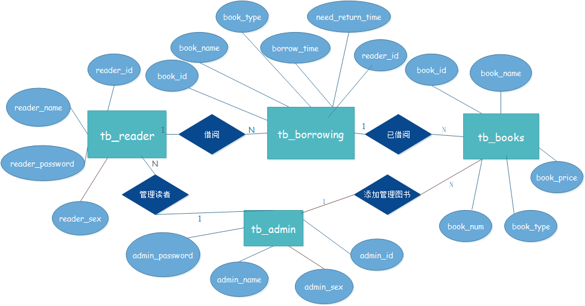

[TOC]

# 基于Java的图书管理系统
## 需求分析


- 角色1： 读者通过登录，可以进行个人信息管理，包括查看个人信息与修改个人信息；同时，可以借阅图书，在此过程可以搜索想要的图书，也可以在书库中直接借阅。还书操作则可以直接点击还书进行。

- 角色2：管理员登录后，可以查看图书，搜索图书，也可以对已有图书进行修改；管理员还具有添加书籍的功能。同时也具有管理读者信息的功能，包括注册读者信息，以及修改已有的读者信息。

## 相关技术

使用Java作为开发语言，主要用到的知识如下：

1.  面向对象编程的继承、封装的思想。
2.  Swing：主要用于该系统的可视化界面，包括按钮、背景、事件监听等
3.  JDBC：该系统的数据全部存储在数据库中，所以通过连接MySQL数据库，然后进行数据的增删改查。
4.    集合类：主要用到了List用于存放从数据库获取的数据，然后将这些数据在放到内存中使用，展示在界面中。
5.  简单的多线程：该系统在系统时间部分使用了多线程，主要应用在读者和管理员登录后，他们的操作界面右上角有实时显示的系统时间，虽然使用的是Swing中的方法，但本质上是多线程。
6.   其他：输入输出等。

## 数据库设计



- 数据库名称：db_library

- 数据库表字段意义如下：

​    *_id : 表示编号

​    *_name : 表示名称

​    *_sex ：表示性别

​    *_password : 表示密码

​    *_price : 表示价格

​    *_type : 表示类型

数据库的表之间的关系如下：

tb_reader :用于存放读者的个人信息。

tb_admin :用于存放管理员的个人信息。

tb_books :用于存放书库中的图书信息。

tb_borrowing :用于存放已经被读者借阅的图书信息。

- 在tb_borrowing中，将会有reader_id和book_id 来明确表中哪一本书被哪个读者借阅。管理员可以对读者信息进行管理，也可以对书库信息进行管理。

## 运行环境配置与使用说明

-   配置数据库信息：通过navicat等软件建立名为db_library的数据库，注意使用utf-8编码（如下图），然后导入源码文件夹里的db_library.sql文件到刚才建的数据库。

- 

-  修改数据库配置的类：将com.database这个包中的DatabaseConfig.java里面的数据库改为自己的信息。即如下操作：

- 

-  将程序代码放在已经Java的环境中，点击“运行”（程序入口在：src.com.gui.Main中）。随后会弹出程序运行界面，此时可以使用下面的测试用例进行测试：

- |         | 账号 | 密码 |
  | ------- | ---- | ---- |
  | 管理员  | 666  | 666  |
  | 读  者1 | 111  | 111  |
  | 读  者2 | 222  | 222  |

## 系统运行界面截图

### 登录模块


- 上图是登录的界面图，其中，身份选择采用的是下拉列表的方式，可以选择读者或者管理员进行登录。

### 管理员操作权限


- 管理员权限包括：注册读者、管理读者信息、新增图书、修改图书、查询图书等等。

### 读者操作权限


- 读者权限包括：查看个人信息、修改个人信息、查找图书、借阅图书、归还图书等等。

## 核心代码说明

```java 
public void loginButton() {
		/**
		 * 这个是登录按钮的事件的内容，将其写成一个函数，在登录按钮的监听中直接调用
		 */
		String identity = (String) identityBox.getSelectedItem();  // 身份
		// 账号
		String userString = userTextField.getText().toString();
		// 密码
		@SuppressWarnings("deprecation")
		String passwordString = passwordField.getText().toString();
		LoginAction loginAction = new LoginAction(userString, identity);

		if ("读者".equals(identity)) {  // 读者登录
			if (userString != null && !"".equals(userString)) {  // 账号不为空
				ReaderInfor readerInfor = new ReaderInfor();
				readerInfor = loginAction.getPassword();  // 到数据库获取密码
				if (!"".equals(readerInfor.getreaderId()) && readerInfor.getreaderId() != null
						&& readerInfor.getreaderPassword().equals(passwordString)) {
					jf.dispose();
					new ReaderMenu(userString); // 去读者界面,同时传递读者的id

				} else {
					JOptionPane.showMessageDialog(
							jf, "账号密码错误,请重新登录！",
							"提示", JOptionPane.WARNING_MESSAGE);
				}

			} else {
				JOptionPane.showMessageDialog(
						jf, "账号不能为空", 
						"提示", JOptionPane.WARNING_MESSAGE);
			}
		}else {    // 管理员登录
			if (userString != null && !"".equals(userString)) {
				AdminInfor adminInfor =new AdminInfor();
				adminInfor = loginAction.getAdminPassword();  // 到数据库获取密码
				if (!"".equals(adminInfor.getadminId()) && adminInfor.getadminId() != null
						&& adminInfor.getadminPassword().equals(passwordString)) {
					jf.dispose();
					new AdminMenu(adminInfor.getadminId());				

				} else {
					JOptionPane.showMessageDialog(
							jf, "账号密码错误,请重新登录！", "提示", JOptionPane.WARNING_MESSAGE);
				}

			} else {
				JOptionPane.showMessageDialog(jf, "账号不能为空",
						"提示", JOptionPane.WARNING_MESSAGE);
			}
		}

	}

```

- 上面是登录操作的代码，首先根据选择的身份进入不同的流程。之后，先要判断账号是否为空，若不为空，则到数据库中去寻找刚才输入的账号所对应的密码（loginAction.getPassword(); ），只有当返回的密码和账号与输入的完全相同，才能登录成功。对于输入错误的情况，通过JOptionPane做相应的提示。

```java
// 使用多线程，显示时间
		JLabel timeJLabel = new JLabel();
		timeJLabel.setFont(new Font("微软雅黑", Font.BOLD, 28));
		Timer timeAction = new Timer(100, new ActionListener() {
			public void actionPerformed(ActionEvent e) {
				long timemillis = System.currentTimeMillis();
				// 转换日期显示格式
				SimpleDateFormat df = new SimpleDateFormat("yyyy-MM-dd HH:mm:ss");
				timeJLabel.setText(df.format(new Date(timemillis)));
			}
		});
		timeAction.start();
		timeJLabel.setBounds(680, 0, 300, 30);
		readerPane.add(timeJLabel);
```

- 上面这一块是显示实时系统时间的代码，本质上使用的是多线程，最后用timeAction.start()来启动线程。

```java 
public List<AllBooks> getBooks() {
		Connection conn = DatabaseConfig.getConnection();
		String sql = "SELECT * FROM tb_books ";						
		List<AllBooks> ab = new ArrayList<AllBooks>();  // 用List来存放书库数据
		try {
			
			PreparedStatement ps = (PreparedStatement) conn.prepareStatement(sql);			
			ResultSet rs = ps.executeQuery();			
			while (rs.next()) {
				AllBooks allbook = new AllBooks();
				allbook.setbookId(rs.getString("book_id"));
				allbook.setbookName(rs.getString("book_name"));
				allbook.setbookNum(rs.getString("book_num"));
				allbook.setbookPrice(rs.getString("book_price"));
				allbook.setbookType(rs.getString("book_type"));
				ab.add(allbook);
			}
			DatabaseConfig.close(conn, ps);  // 关闭连接

		} catch (SQLException e) {
			e.printStackTrace();
		}
		return ab;
	}
```

- 上面的代码是封装的SQL相关的类的获取书库的方法。使用List来存放从数据库中获取到的数据，然后返回到界面中。对于ReaderAction.java以及AdminAction.java这些类里面的方法其实都是用来与数据库进行交互的SQL语句。为了减少篇幅，可以到com.database这个包中查看更多类似的代码。

